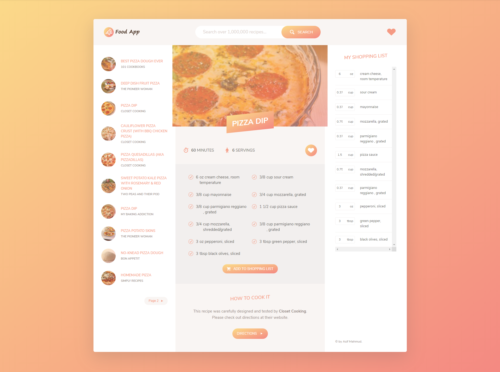

# Food App

Food app is a recipe searching web application with a beautiful design. The app fetch the recipes from a real recipe API. 

## Features

* Search for a lot of recipes
* Fetch recipe information with images from a real API
* Ingredient list
* Choosing servings and modify ingredients
* Editing and add ingredients to shopping list
* Add to favorite recipes

## Technologies Used

* HTML5
* CSS3
* JavaScript ES6
* npm packages
    * Webpack
    * Babel
    * Axios
    * Fractional
    * Uniqid

## How to Use

In the dist folder I have already bundled up the javascript modules and put in the html and css. So the finished project is in the dist folder.

### Make Changes

Changes can be done from the src folder and bundle up javascript modules again in the dist folder with the following command

```
npm run build
```

This will bunlde the javascript modules again and put it in the dist folder in the correct location reflecting the new changes.

### Live App

You can check out this app live by going to 
[Pro Valley](https://asif-mahmud25.github.io/pro-valley/) and then to Food App.


## Sreenshot

